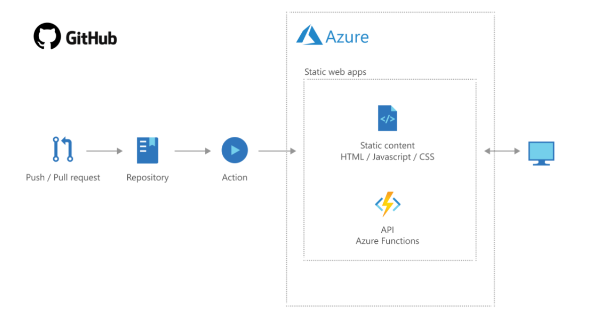

# Portfolio Website

This is an online portfolio made with Gatsby, GitHub and Azure Static Web Apps. It makes use of CI/CD using GitHub Actions to automatically build and deploy after each commit.

The resume menu button is another project you can see [here.](https://github.com/Kinda-Nefarious/azure-resume)

The blog menu tab button leads to my blog that you can see [here.](https://blog.rufaronyakudya.com/)

You can read more about this project [here.](https://blog.rufaronyakudya.com/cloud-portfolio-website)

## Architecture

### Technologies used

- Javascript
- HTML
- Github (Source Control)
- Github Actions (CI/CD)
- Azure Static Web Apps

## Project Goals

The purpose of this project is to was to build a porfolio website to showcase myself and my projects. I aim to further increase the scope of the project by adding new widgets and projects contained within the website. 

## Further Work Planned

- Add widgets
- Increase use of security features
- Add monitoring

## License
Licensed under MIT License.